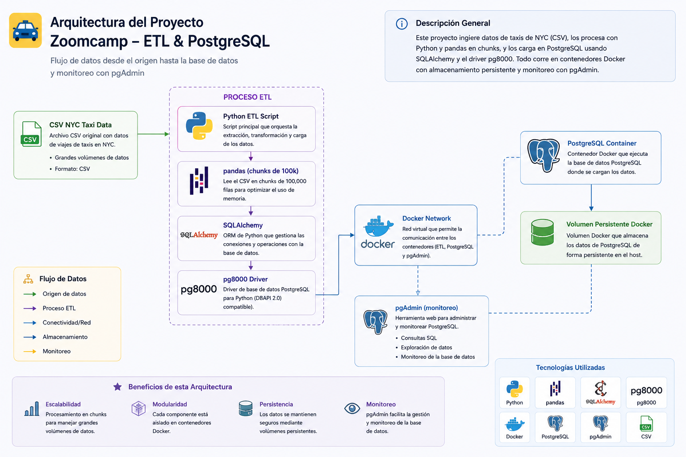

# NYC Taxi Data Engineering Pipeline 🚕

Proyecto de práctica basado en el Data Engineering Zoomcamp.

Este proyecto construye un pipeline básico de ingesta de datos utilizando:

- Docker
- PostgreSQL
- pgAdmin
- Python
- pandas
- SQLAlchemy
- pg8000
- UV

El objetivo es cargar datos masivos de NYC Taxi Trips a PostgreSQL utilizando procesamiento por chunks.

---

# Arquitectura



CSV → pandas → SQLAlchemy → PostgreSQL → pgAdmin

---

# Tecnologías utilizadas

- Python 3.13
- Docker
- PostgreSQL 13
- pgAdmin 4
- pandas
- SQLAlchemy
- pg8000
- UV

---

# Estructura del proyecto

```

pepeline-ingesta/
│
├── data/
│ ├── yellow_tripdata_2021-01.csv
│ └── yellow_tripdata_2021-01.csv.gz
│
├── scripts/
│ ├── ingest_data.py
│ ├── ingest_data_args.py
│ ├── test_pg8000.py
│ └── descomprimir.py
│
├── Dockerfile
├── pyproject.toml
├── uv.lock
├── .gitignore
└── README.md

````md
---

# Levantar PostgreSQL con Docker

## Crear red Docker

```bash
docker network create pg-network
```

---

## Levantar PostgreSQL

```bash
docker run -d ^
  --name pgdatabase ^
  --network pg-network ^
  -e POSTGRES_DB=ny_taxi ^
  -e POSTGRES_USER=root ^
  -e POSTGRES_PASSWORD=root ^
  -p 5433:5432 ^
  -v ny_taxi_data:/var/lib/postgresql/data ^
  postgres:13
```

---

## Levantar pgAdmin

```bash
docker run -d ^
  --name pgadmin ^
  --network pg-network ^
  -e PGADMIN_DEFAULT_EMAIL=admin@admin.com ^
  -e PGADMIN_DEFAULT_PASSWORD=root ^
  -p 8080:80 ^
  dpage/pgadmin4
```

---

# Instalar dependencias

## Crear entorno virtual

```bash
uv venv
```

---

## Instalar librerías

```bash
uv add pandas sqlalchemy pg8000
```

---

# Ejecutar pipeline

```bash
uv run python scripts/ingest_data_args.py ^
  --calendar_month 2021-01 ^
  --data_path data ^
  --table_name yellow_taxi_data
```

---

# Verificar datos en PostgreSQL

## Entrar a pgAdmin

```text
http://localhost:8080
```

---

## Credenciales

```text
Email: admin@admin.com
Password: root
```

---

## Ejecutar consulta SQL

```sql
SELECT COUNT(*)
FROM yellow_taxi_data;
```
````
